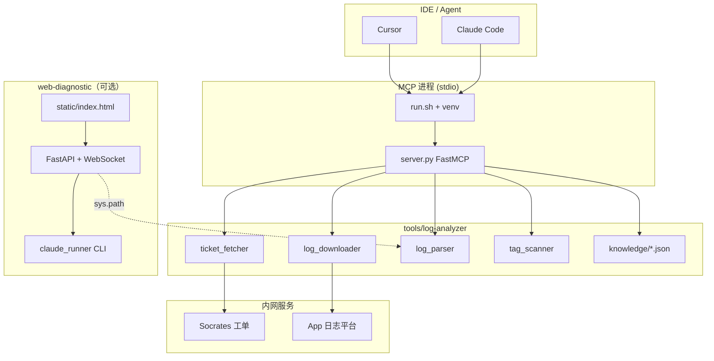
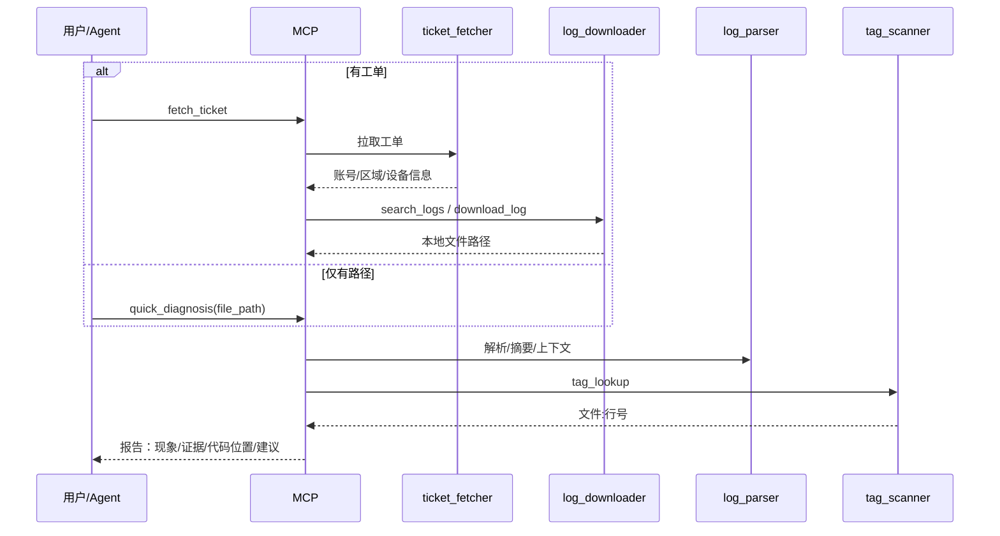

# Device Core AI Toolkit — 工程指引与架构说明

**版本说明**：本文档与仓库 `README.md` 互补；侧重架构边界、运维流程与扩展规范。  
**适用对象**：SDK 研发、日志排查、平台工具维护、新成员 onboarding。

---

## 1. 项目定位

本仓库（对外常称 **device-core-ai-toolkit** / 日志排查工具集）为 **Tuya DeviceCore（Android）** 配套的 AI 开发与线上日志诊断基础设施，目标能力包括：


| 能力          | 说明                                                              |
| ----------- | --------------------------------------------------------------- |
| **工单 → 日志** | 从 Socrates 工单提取关键字段，对接内部 App 日志平台搜索/下载                          |
| **日志解析**    | 统一解析多种设备/App 日志格式，统计、过滤、Error 上下文                               |
| **代码关联**    | 通过 TAG 索引将日志 TAG 映射到 SDK 源码位置                                   |
| **场景诊断**    | 基于可维护的 JSON 知识库做场景化排查与 BLE 协议辅助查询                               |
| **IDE 集成**  | Cursor / Claude Code 通过 MCP 调用上述能力；可选 Web 端上传 + Claude CLI 流式诊断 |


---

## 2. 逻辑架构




**设计要点**：

- **单一事实源**：日志分析核心逻辑集中在 `tools/log-analyzer`，Web 层通过路径注入复用解析能力，避免两套实现分叉。
- **MCP 为 IDE 主入口**：生产排查以 Cursor/Claude + MCP 为主；Web 适合本地上传、会话排队与 CLI 流式体验。

---

## 3. 仓库目录与职责

### 3.1 根目录


| 路径                            | 职责                                                                     |
| ----------------------------- | ---------------------------------------------------------------------- |
| `README.md`                   | 快速上手、目录树、MCP 能力摘要、`ai-setup.sh` 用法                                     |
| `ai-setup.sh`                 | 克隆/更新 `.ai-config`，建立 `.cursor`、`.claude`、`tools` 等符号链接，统一分发规则与 MCP 配置 |
| `.gitignore` / `cursorignore` | 版本控制与 Cursor 索引忽略                                                      |


### 3.2 Cursor 配置 (`cursor/`)


| 路径                                           | 职责                                                                        |
| -------------------------------------------- | ------------------------------------------------------------------------- |
| `mcp.json`                                   | 注册 MCP：`bash tools/log-analyzer/run.sh`，`PROJECT_ROOT=${workspaceFolder}` |
| `rules/*.mdc`                                | 项目概览、模块边界、构建命令、日志诊断规则（含工具选用顺序）                                            |
| `skills/**/SKILL.md`                         | Agent 技能：分支/仓库、依赖切换、日志分析、发版、提交等                                           |
| `commands/*.md`                              | 可触发的斜杠命令模板（PR、Review、上传、分析日志等）                                            |
| `hooks.json` + `hooks/check-api-boundary.sh` | 提交前 API 边界检查（依赖 `jq`）                                                     |


### 3.3 Claude Code 配置 (`claude-code/`)


| 路径                  | 职责                                 |
| ------------------- | ---------------------------------- |
| `CLAUDE.md`         | Claude Code 专用补充（与根文档去重）           |
| `settings.json`     | MCP、Hooks                          |
| `mcp.json`          | 与 Cursor 同源指向 `tools/log-analyzer` |
| `rules/*.md`        | 与 Cursor rules 对应的 Markdown 版      |
| `commands`、`skills` | **符号链接**至 `cursor/`，零重复维护          |


### 3.4 日志分析核心 (`tools/log-analyzer/`)


| 文件                    | 职责                                                                 |
| --------------------- | ------------------------------------------------------------------ |
| `server.py`           | **FastMCP 服务**：注册全部 MCP 工具，加载 TAG 索引与知识库，编排诊断流程                    |
| `log_parser.py`       | 日志解析引擎：JSON 行 / 格式化 Logcat / Android Studio Logcat；摘要、过滤、Error 上下文 |
| `log_downloader.py`   | 内网 App 日志平台：按 ticketId、uid、账号搜索与下载；SSO（环境变量或 Chrome Cookie）        |
| `ticket_fetcher.py`   | Socrates 工单：拉取详情并解析账号、区域、PID、设备 ID、App/SDK 版本等                     |
| `tag_scanner.py`      | 扫描 Java/Kotlin 中 `L.i/d/w/e` 与 TAG 定义，构建 TAG → 文件/类/行 映射           |
| `run.sh`              | 创建/使用本地 `.venv`（Python ≥ 3.10），设置 `PROJECT_ROOT`，启动 `server.py`    |
| `requirements.txt`    | Python 依赖                                                          |
| `verify-knowledge.sh` | 校验知识库中 TAG 是否仍存在于代码、`_meta` 是否超期                                   |
| `knowledge/*.json`    | 场景化故障知识库（BLE、MQTT、离线、OTA 等）；含 `_meta` 版本与更新日期                      |
| `data/`               | 运行时数据：下载的日志、`tag-index.json` 等（通常不提交）                              |


### 3.5 Web 诊断 (`web-diagnostic/`)


| 文件                  | 职责                                                          |
| ------------------- | ----------------------------------------------------------- |
| `server.py`         | FastAPI：静态页、日志上传、WebSocket、**单 Worker 任务队列**、对接 Claude 流式输出 |
| `claude_runner.py`  | 定位本机 `claude` CLI，解析流式 JSON 事件（文本/工具调用/结果）                  |
| `static/index.html` | 前端诊断界面                                                      |
| `start.sh`          | 启动服务                                                        |
| `requirements.txt`  | Web 依赖                                                      |
| `.env.example`      | 环境变量示例（如 `WORKSPACE_ROOT`）                                  |
| `data/history/`     | 会话历史（运行时）                                                   |


---

## 4. 环境与部署要点

### 4.1 MCP（IDE 侧）

1. 工作区需能访问 `tools/log-analyzer`（本仓库直接存在或通过 `ai-setup.sh` 链到 `.ai-config`）。
2. 首次运行由 `run.sh` 自动创建 `.venv` 并安装依赖；需 **Python 3.10+**。
3. `PROJECT_ROOT`：Cursor 通过 `mcp.json` 注入为工作区根目录，用于 TAG 扫描范围。

### 4.2 日志与工单能力（内网）

- **SSO**：`SSO_USER_TOKEN` 环境变量，或本机 Chrome 已登录 + `browsercookie`（见 `log_downloader.py`）。
- **网络**：日志平台、Socrates 为内网域名；无外网或未登录时相关工具会失败，属预期行为。

### 4.3 Web 诊断

- 配置 `WORKSPACE_ROOT` 等（见 `.env.example`），使上传目录与知识库路径与团队规范一致。
- 依赖本机安装 **Claude Code CLI**；队列保证同一时刻单任务，避免资源争抢。

### 4.4 自检（`ai-setup.sh --verify`）

建议定期执行：符号链接、组件文档、`venv`/fastmcp、jq、groovy、Hook 可执行性、TAG 索引、知识库校验等。

---

## 5. MCP 工具一览

以下为 `server.py` 暴露的主要能力（名称以实际 MCP 为准）。


| 工具                                             | 用途                                   |
| ---------------------------------------------- | ------------------------------------ |
| `quick_diagnosis`                              | **首选**：单文件一键摘要 + Error 聚类 + TAG/场景线索 |
| `diagnose_scenario`                            | 按问题描述匹配知识库并过滤相关日志                    |
| `scenario_timeline`                            | 按场景做时间线/重试等行为分析（见实现）                 |
| `fetch_ticket`                                 | 工单 URL/ID → 摘要 + 自动搜日志参数             |
| `search_logs`                                  | ticketId / uid / 账号搜索日志记录            |
| `download_log`                                 | 下载日志到本地路径                            |
| `log_summary`                                  | 时间范围、级别分布、TAG Top、Error 列表等          |
| `filter_logs`                                  | 按 TAG（模糊）、级别、时间窗过滤                   |
| `error_context`                                | Error 行前后时间窗口上下文                     |
| `tag_lookup` / `search_related_tags`           | TAG → 源码位置 / 相关 TAG                  |
| `error_code_lookup`                            | 错误码说明（辅助，不可替代读代码）                    |
| `build_tag_index` / `refresh_tag_index`        | 构建或刷新 TAG 索引                         |
| `refresh_aibuds_catalog`                       | 扫描 iOS AIBuds ObjC 日志，刷新模块目录         |
| `refresh_aibuds_knowledge`                     | 一键刷新 AIBuds 知识资产（扫描+生成+校验）          |
| `ble_command_lookup` / `ble_protocol_overview` | BLE 指令与协议参考（按需调用）                    |


**诊断原则（与 `cursor/rules/04-log-diagnosis.mdc` 一致）**：

1. 优先 `quick_diagnosis`，减少往返次数。
2. 根因需结合 `**tag_lookup` + 阅读源码**；错误码与知识库仅为辅助。
3. BLE 日志需协议语义时再调用 `ble_`*。

---

## 6. 标准排查工作流




---

## 7. 知识库与 TAG 索引维护

### 7.1 知识库 (`knowledge/*.json`)

- 每个场景文件描述症状、过滤关键词、排查步骤等；顶层可含 `_meta`：  
`updated`、`sdk_version` 等，便于审计与过期提醒。AIVoice 流式 WebSocket / Token / Session 链路见 `knowledge/aivoice-streaming-channel.json`。
- 修改后运行：

```bash
tools/log-analyzer/verify-knowledge.sh
# 可选：自定义未更新天数阈值
tools/log-analyzer/verify-knowledge.sh --stale-days 90
```

### 7.2 TAG 索引

- SDK 代码变更后应执行 `build_tag_index` 或 `refresh_tag_index`，保证日志 TAG 与源码一致。
- 索引默认写入 `tools/log-analyzer/data/tag-index.json`（路径以实际 `DATA_DIR` 为准）。

### 7.3 AIBuds 两层知识模型

AIVoice（iOS）模块采用两层知识体系：

| 层级 | 位置 | 内容 | 更新方式 |
|------|------|------|----------|
| 模块知识 | `knowledge/modules/aibuds-*.json` | 按 `AIBuds_*` 模块沉淀的日志信号、关联模块 | 扫描器自动生成 + 人工补充 |
| 场景知识 | `knowledge/aivoice-*.json` | 按故障场景编排排查顺序，引用模块知识 | 人工为主 |

**模块知识文件**中每条信号有 `source` 字段区分来源：
- `auto`：扫描器产出，每次刷新覆盖
- `human`：人工补充，扫描器不触碰

**场景知识文件**通过 `module_refs` 字段声明引用的模块列表。

#### 刷新流程

每次版本迭代后执行：

```bash
# 方式一：MCP 工具（在 Cursor/Claude 中）
refresh_aibuds_knowledge

# 方式二：命令行
python tools/log-analyzer/aibuds_scanner.py \
  .cursor/rules/aibuds.mdc \
  ../Modules/ThingAudioRecordModule/ThingAudioRecordModule/Classes \
  ../Modules/ThingAutomaticSpeechRecognitionModule/ThingAutomaticSpeechRecognitionModule/Classes
```

产出：
1. `data/aibuds-module-catalog.json` — 扫描中间产物
2. `knowledge/modules/_catalog.json` — 模块总览
3. `knowledge/modules/aibuds-*.json` — 各模块知识文件

刷新后运行 `verify-knowledge.sh` 校验引用完整性。

---

## 8. 安全与合规提示

- **凭证**：禁止将真实 `SSO_USER_TOKEN`、Cookie 或内网 URL 中的敏感片段写入仓库与公开文档。
- **日志内容**：用户日志可能含 PII；存储、传输与 AI 上下文需遵守公司与数据安全规范；Release 日志勿打印 Token/密码。
- **TLS**：内网客户端若使用 `verify=False` 等，仅限受控环境，上线改造需走安全评审。

---

## 9. 扩展与协作规范


| 场景        | 建议                                                                |
| --------- | ----------------------------------------------------------------- |
| 新增 MCP 工具 | 在 `server.py` 注册，复用 `log_parser` / `log_downloader`；补充 README 与本表 |
| 新日志格式     | 在 `log_parser.py` 增加识别分支与单测（若有）                                   |
| 新故障场景     | 新增或扩展 `knowledge/*.json`，跑 `verify-knowledge.sh`                  |
| IDE 规则变更  | 同步考虑 Cursor `.mdc` 与 Claude Code `.md` 的内容一致性（职责不同但语义应对齐）         |


---

## 10. 相关文档索引


| 文档                                  | 说明                            |
| ----------------------------------- | ----------------------------- |
| 根目录 `README.md`                     | 安装、MCP 列表简表、`ai-setup`、pip 依赖 |
| `cursor/rules/04-log-diagnosis.mdc` | Agent 侧日志诊断行为约束               |
| `tools/log-analyzer/README.md`      | 子模块说明（若存在）                    |
| 本文档 `docs/ENGINEERING_GUIDE.md`     | 架构与工程流程总览                     |


---

*文档随仓库演进更新；若 MCP 工具集有增减，请以 `tools/log-analyzer/server.py` 为准并回写第 5 节。*